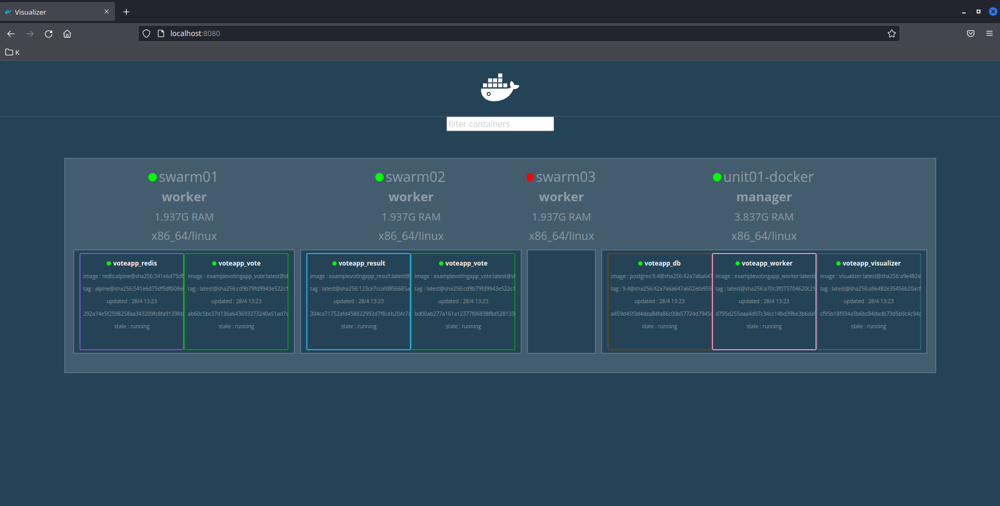

# Docker Mastery: w/ k8s && swarm

Table of contents
=================

<!--ts-->
  * [Prerequisites](#prerequisites)
  * [Installation and Containers](#installation-and-containers)
  * [Networks](#networks)
  * [Images](#images)
  * [Dockerfile](#dockerfile)
    * [Sample Dockerfile 1](#sample-dockerfile-1)
  * [Container lifetime and Persistent Data](#container-lifetime-and-persistent-data)
    * [Create a named volume](#create-a-named-volume)
    * [Bind Mounts](#bind-mounts)
  * [Docker Compose](#docker-compose)
    * [docker-compose.yml](#docker-compose.yml)
      * [Template](#template)
      * [Examples](#examples)
        * [NGINX Proxy](#nginx-proxy)
        * [Build with Compose](#build-with-compose)
  * [Swarm Mode](#swarm-mode)
    * [Stacks](#stacks)
      * [Voting App](#voting-app)
    * [Secrets](#secrets)
      * [Secrets with Services](#secrets-with-services)
      * [Secrets with Stacks](#secrets-with-stacks)
      * [Secrets with local Compose](#secrets-with-local-compose)
  * [Examples](#examples)
    * [Create Swarm Service locally](#create-swarm-service-locally)
    * [MultiNode Swarm](#multinode-swarm)
    * [Overlay Multi-Host Networking](#overlay-multi-host-networking)
    * [Routing Mesh](#routing-mesh)
    * [Service Updates](#service-updates)
  * [Swarm App Lifecycle](#swarm-app-lifecycle)
    * [Healthchecks](#healthchecks)
  * [Container Placement`](#container-placement)
    * [Service Constraints](#service-constraints)
    * [Service Mode](#service-mode)
    * [Placement Preference](#placement-preference)
    * [Node Availability](#node-availability)
    * [Resource Requirements](#resource-requirements)
  * [Service Logs](#service-logs)
  * [Docker Events](#docker-events)
  * [Swarm Configs](#swarm-configs)
  * [Rolling Updates](#rolling-updates)
    * [Testing Rolling Service Updates](#testing-rolling-service-updates)
  * [Container Registries](#container-registries)
    * [Running Docker Registry](#running-docker-registry)
    * [Using Docker Registry with Swarm](#using-docker-registry-with-swarm)
  * [Docker in Production](#docker-in-production)
  * [Cheat Sheet](#cheat-sheet)


  


<!--te-->

Prerequisites
=============
  - Local admin access to install:
    - VirtualBox
    - Docker
    - Docker Compose
  - Linux basics like shells, SSH, package managers
  - Understand the basics of web and database servers
  - DockerHub Account


Installation and Containers
===========================

[Install Docker Engine](https://docs.docker.com/engine/install/)
```bash
curl -fsSL https://get.docker.com -o get-docker.sh
```
To use Docker as a non-root user, consider adding the user to the docker group:
```bash
sudo usermod -aG docker <username>
```
Download docker-compose from [Compose repository release page on GitHub](https://github.com/docker/compose/releases)
```bash
sudo curl -L "https://github.com/docker/compose/releases/download/1.29.2/docker-compose-$(uname -s)-$(uname -m)" -o /usr/local/bin/docker-compose
sudo chmod +x /usr/local/bin/docker-compose
```

Check docker-compose version:
```bash
docker-compose --version
```

Versions
--------
Docker versions are YY.MM[^1] based.

[^1]: Year / Month


  - **Edge** ➜ monthly release and one month support
  - **Stable** ➜ quarterly release and 4 months support

## More information about the client and server
```bash
docker info
```
## Managment commands
```bash
docker <command> <sub-command> (options)
```


Image vs Container
------------------
  - **Image** is the app to run
  - **Container** is an instance of that image running as process. There can be many containers.

Docker's default image registry is [Docker Hub](https://hub.docker.com/).

## Starting an Nginx Server
Download an image from DockerHub and start a container from that image:
```bash
docker container run --publish 80:80 nginx
```
The command `docker container run` does the following:
  1. Looks for the image locally in the image cache
  2. If not found localy, it looks for the same in the remote image repo which defaults to DockerHub and downloads the latest version
  3. Creates a container based on that image and prepares to start
  4. Gives the container a virtual IP on a private network inside the Docker engine
  5. Opens up port 80 on the host and forwards all requests to port 80 in the container
  6. Starts container by using the CMD instruction command in the image's dockerfile

## 💡 Instruction commands

There are three types of instructions (commands) that we can use to build and run Dockerfiles:

  1. **RUN** - Mainly used to build images and install applications and packages. Builds a new layer over an existing image by committing the results.

  2. **CMD** - Sets default parameters that can be overridden from the Docker CLI when a container is running.

  3. **ENTRYPOINT** - Default parameters that cannot be overridden when Docker Containers run with CLI parameters.

## Running container in the background:
```bash
docker container run --publish <port-host>:<port-container> --detach <image>

# Example
docker container run --publish 80:80 --detach nginx
```

## Give a name to the container:
```bash
docker container run -p 80:80 -d --name webhost nginx
```
  `-p` is short for `--publish` and `-d` is short for `--detach`

## List all containers:
```bash
docker container ls -a
```

Networks
========

## Get port details for a container:
```bash
docker container port <container-name>

# 80/tcp -> 0.0.0.0:80
# 80/tcp -> :::80
```

## Get IP for container:
```bash
docker container inspect --format '{{ .NetworkSettings.IPAddress }}' webhost
```

## How netowkring happens with Docker containers?


Virtual networks get created when we publish a container. If we publish container **C1** with `80:80`, it means any traffic coming at port 80 on the host will be forwarded to port 80 on container **C1** via the virtual network. Creating another container **C2** by default will be put in the same virtual network, which means, **C1** and **C2** can communicate freely via this virtual network.

  **NOTE:** A Host port can only be linked to one container.
  **Bridge** or **Docker0** is the default virtual network mapped to the host IP.

## Docker Network CLI commands

```bash
docker network ls               # list networks
docker network inspect          # returns JSON metadata about the network
docker network create           # create a network
docker network connect          # attach a network to container
docker network disconnect       # detach a network from container
docker network rm               # remove one or more networks
docker network prune            # remove all unused networks
```

## Default network types

1. **Bridge** or **Docker0** - is the default virtual network mapped to the host IP. It allows containers to communicate with each other when running on the smae docker host.

2. **host** - a special network that attaches the container directly to the host by skipping virtual network.

3. **none** - only `localhost` interface is available in container

Using Docker networks we can ensure that:

1. Related apps are on the same Docker network
2. Their inter-communication is restricted to the virtual network
3. Traffics can be forwarded from host to container only if we publish container with `--publish` or `-p`

## DNS
Containers can communicate with other containers in the same virtual network with host names.

Docker defaults host name to container's name. However, we can also use aliases.

To provide network aliases for containers, we can do the following:
```bash
 docker container run --rm --network <network-name> --network-alias <container-network-alias> <image>
```

So, with this containers in the same virtual network can communicate with each other via aliases.
  The flag `--rm` makes sure the container is deleted permanently on exit.
  
Images
======
An **image** contains the application binaries, application dependencies, metadata about the image and how to run the image.

## Images on Docker Hub
Official images on Docker Hub just have an `<image-name>` unlike others which follow the format `<author-name>/<image-name>`.

## Pull an image:
```bash
# Pulls the latest version
docker pull <image-name>
```

## Pull a specific version of the image:
```bash
docker pull <image-name>:<image-version>
```

## Pull a specific version and distribution of the image:
```bash
docker pull <image-name>:<image-version>-<dist>
```

## Push image changes
To upload changed layers to an image registry:
```bash
docker image push <image-name>
```

**NOTE:** To perform push, we need to login with `docker login`.

## List all images:
```bash
docker image ls
```
## Image layer
Image layers present a series of file system changes as an actual file system.

## View image history
```bash
docker history <image-name>:image-version>
```

Each layer in the image has a unique SHA, so that, if another image has a same version of a layer and the layer exists in the cache, that layer will be re-used, i.e., the rest of the layers in the image are run on top of the cached layer.
  Same layers are not stored more than once on the host system.

## Container layer
Container layer is a read and write layer created on top of the image layer.

When a file on the image is changed as part of the container, the difference in the file is copied over to the container (**copy on write**) without making any changes in the history of the container.

## Inspect image
```bash
# Get JSON metadata about the image
docker inspect <image-name>:<image-version>
```

## Image tags
Tagging an image
```bash
docker image tag <source-image>:<source-tag> <target-image>:<target-tag>
```
Tags will default to `latest` unless specified.
  `latest` is just a default tag that should be assigned to the newest stable version.

## Build an image
```bash
docker image build -t <image-name> .
```
The `.` will search for the default Dockerfile.
  `-t` is a shorthand for tag.

## Prune commands
```bash
docker image prune
```
Clean up everything:
```bash
docker system prune
```
Remove all unused images:
```bash
docker image prune -a
```
View space usage:
```bash
docker system df
```


Dockerfile
==========
  - Dockerfiles[^2] are part process workflow and part art.
[^2]: https://www.geeksforgeeks.org/what-is-dockerfile-syntax/

## Commands
  - Each of the commands mentioned below is an actual layer
  - The order of the mentioned commands is important as it works top > down

## FROM
  - **package managers** like `apt` and `yum` are one of the reasons to build containers from Debian, Ubuntu, Fedora, or CentOS

## ENV - Environment Variables
  - One reason they were chosen as preferred way to inject key/value is they work everywhere, on every OS and config

## RUN
  - Executing shell commands insite the container as it is building it
    - Install software from the package repository
    - Unzipping
    - Create/Move/Delete some folders/files inside the container itself
    - Run shell scripts
    - Add additional repositories to package manager source list
  - Access to all the commands and binaries that have been installed with the OS release
  - Add commands and ampersand **'&&'** sign to execute these commands as a one layer
    - When placing command on next line use the backslash `'\'`

## Logging setup
  - Eveything has to be sent to stdout and stderr
    - We achieve this by creating symlink from log file to device file 
```bash
# Example
RUN ln -sf /dev/stdout /var/log/nginx/access.log \
    && ln -sf /dev/stderr /var/log/nginx/error.log
```

## Expose
  - Expose ports on the docker virtual network
  - To open/forward ports to host `-p` or `-P` have to be used

## CMD
  - **REQUIRED**
  - Final command that will be run everytime we launch new container from the image or everytime we restart/start container
  - Only one CMD is allowed
    - If there are multiple, last one wins

## Usage
  - Build Image from Dockerfile in current directory
```bash
docker image build -t name .
```

Sample Dockerfile 1
-------------------
[This](udemy-docker-mastery/dockerfile-sample-1/Dockerfile) is a sample of a dockerfile we are going to build. And [here](udemy-docker-mastery/dockerfile-sample-1/build-output.txt) is the output of 'docker image build'

  - Each step is a command in above Dockerfile
  - Hashes
    - Each step has assigned a hash that is stored in docker cache
    - Next time we build this image it will use built layers for lines of Dockerfile that were not changed
    - This is possible thanks to union filesystem
    - Saves consecutive build times rapidly
  - When you change only source code of your application but not Docker image itself, Docker knows that rebuilding of the entire image is not needed and it rebuilds only parts from change down. 
  - For this reason is important to put steps that are changing often close to bottom in the file


Container lifetime and Persistent Data
======================================

*Containers are immutable. We can only re-deploy containers but not change existing ones. This helps in retaining history changes.*

## Persisting data across containers
There are two options:
  1. Bind mounts 
  2. Volumes

| Bind Mount | Volume|
| --- | --- |
| When we use a bind mount, a file or directory on the host machine is mounted into a container. This file or directory is referenced by its absolute path on the host machine. | When we use a volume, a new directory is created within Docker's storage directory on the host machine and it's contents are completely managed by Docker. |
|  | Volumes need manual deletion. They can't be cleaned up just by removing a container
|

## Prune
To cleanup unused volumes:
```bash
docker volume prune
```
## List all volumes
```bash
docker volume ls
```
Create a named volume
---------------------
We can have a named volume with the `-v` flag.
```bash
docker container run -d --name mysql-container -e MYSQL_ALLOW_EMPTY_PASSWORD=True -v <volume_name>:/var/lib/mysql mysql
```
The `-v` command allows us to do the following:
  1. Create a new volume for a container
  2. Create a named volume

Bind Mounts
-----------
Instead of `volume_name`, we specify the absolute path of the file or folder in the host in the above command.
```bash
docker container run -d --name mysql-container -e MYSQL_ALLOW_EMPTY_PASSWORD=True -v /<absolute_path_on_host>:/var/lib/mysql mysql
```

## Creating docker volumes manually
We can create docker volumes manually using docker `volume create`.
This is required when we want to use custom drivers and labels.

**NOTE:** We need to do this before `docker run`.


Docker Compose
==============

  - Why: configure relationships between containers
  - Why: save our docker container run settings in easy-to-read file
  - Why: create one-liner developer environment startups
  - Comprised of 2 separate but related things
    1. YAML - formatted file that describes our solution options for:
        - containers
        - networks
        - volumes
    2. A CLI tool docker-compose used for local dev/test automation with those YAML files

## docker-compose CLI [^3]
[3^]: https://docs.docker.com/compose/reference/
  - CLI tool comes with Docker for Windows/Mac, but separate download for Linux
  - Not a production-grate tool but ideal for local development and test
  - If all your projects had a `Dockerfile` and `docker-compose.yml` then "new developer onboard" would be:
    - `git clone github.com/some/software`
    - `docker-compose up`

## External Links

  - [YAML Tutorial: Everything You Need to Get Started in Minutes](https://www.cloudbees.com/blog/yaml-tutorial-everything-you-need-get-started)
  - [The Yaml Format: Quick Reference](https://yaml.org/refcard.html)
  - [Compose File Version Differences (Docker Docs)](https://docs.docker.com/compose/compose-file/compose-versioning/)
  - [Docker Compose Release Downloads (good for Linux users that need to download manually)](https://github.com/docker/compose/releases)
  - [Multiple Compose files](https://docs.docker.com/compose/extends/#multiple-compose-files)
  - [Using Compose in production](https://docs.docker.com/compose/production/)

docker-compose.yml
------------------  
  - Compose YAML format has its own versions.
  - `docker-compose.yml` is default filename, but any can be used with `docker compose -f <filename>`

## Template

```yaml
version: '3.8'  # if no version is specificed then v1 is assumed. Recommend v2 minimum

services:  # containers. same as docker run
  servicename: # a friendly name. this is also DNS name inside network
    image: # Optional if you use build:
    command: # Optional, replace the default CMD specified by the image
    environment: # Optional, same as -e in docker run
    volumes: # Optional, same as -v in docker run
  servicename2:

volumes: # Optional, same as docker volume create

networks: # Optional, same as docker network create
```

Swarm Mode
==========
  - Swarm mode is a clustering solution build inside Docker
  - Not related to swarm "classic" for pre-1.12 versions
  - Added in 1.12 (Summer 2016) via SwarmKit toolkit
  - Enhanced in 1.13 (January 2017) via Stacks and Secrets
  - Not enabled by default, new commands once enabled:
    - docker swarm
    - docker node
    - docker service
    - docker stack
    - docker secret

**These were the questions people asked before swarm mode**

>- How do we automate container lifecycle?
>- How can we easily scale out/in/up/down?
>- How can we ensure our containers are re-created if they fail?
>- How can we replace containers without downtime (blue/green deploy)?
>- How can w control/track where containers get started?
>- How can we create cross-node virtual networks?
>- How can we ensure only trusted servers run our containers?
>- How can we store secrets, keys, passwords and get them to the right container (and only that container)?

Basic Concepts
--------------
  - Swarm can be enabled with docker swarm init

Manager Nodes
--------------


  - These blue boxes are `manager nodes`
    - Have database locally on them (known as Raft database)
      - It stores their configuration and gives them all information they need to have to be the authority inside the swarm
    - Encrypt their traffic
    - Docker recommends a maximum of seven manager nodes for a swarm.


Worker Nodes
------------
Worker nodes are also instances of Docker Engine whose sole purpose is to execute containers. Worker nodes don’t participate in the Raft distributed state, make scheduling decisions, or serve the swarm mode HTTP API.
  - You can create a swarm of one manager node, but you cannot have a worker node without at least one manager node
  - By default all managers are also workers.
**Manager nodes are basically a worker nodes with permission to manage the swarm**


Swarm Service
-------------
  - `docker service` in a swarm replaces `docker container run` command


External Links
--------------
  - [Docker 1.12 Swarm Mode Deep Dive Part 1: Topology](https://www.youtube.com/watch?v=dooPhkXT9yI&ab_channel=Docker)
  - [Docker 1.12 Swarm Mode Deep Dive Part 2: Orchestration](https://www.youtube.com/watch?v=_F6PSP-qhdA&ab_channel=Docker)
  - [Heart of the SwarmKit: Topology Management](https://speakerdeck.com/aluzzardi/heart-of-the-swarmkit-topology-management)
  - [Heart of the SwarmKit: Store, Topology & Object Model](https://www.youtube.com/watch?v=EmePhjGnCXY&ab_channel=Docker)
  - [Raft Consensus Visualization (Our Swarm DB and how it stays in sync across nodes)](http://thesecretlivesofdata.com/raft/)

---

Stacks
======
  * In 1.13 Docker added a new layer of abstraction to Swarm called Stacks
  * Stacks accept Compose files as their declarative definition for services, networks, and volumes
  * We use `docker stack deploy` rather than docker service create
  * Stacks manages all those objects for us, including overlay network per stack. Adds stack name to start of their name
  * New `deploy`: key in Compose file. Can't do `build:`
  * Compose now ignores `deploy:`, Swarm ignores `build:`


Keep in mind
------------
  - Update of stack is done with same command as creating it.
```bash
docker stack deploy -c app-stack.yml app
```
  - **You want to do all the changes in the YAML Stack file and never directly via docker commands, because yaml is the source of truth and any of your changes that are not reflected in file are going to be overwritten.**

Voting App
----------


[Stack file](udemy-docker-mastery/swarm-stack-1/example-voting-app-stack.yml)

Output
------
```bash
┌──(x0r[🐳]unit01-docker)-[~/Docker/udemy-docker-mastery/swarm-stack-1]
└─$ docker stack deploy -c example-voting-app-stack.yml voteapp
Creating network voteapp_backend
Creating network voteapp_frontend
Creating service voteapp_visualizer
Creating service voteapp_redis
Creating service voteapp_db
Creating service voteapp_vote
Creating service voteapp_result
Creating service voteapp_worker
                                                                                                                                                                                                                                             
┌──(x0r[🐳]unit01-docker)-[~/Docker/udemy-docker-mastery/swarm-stack-1]
└─$ docker stack ls                                            
NAME      SERVICES   ORCHESTRATOR
voteapp   6          Swarm
                                                                                                                                                                                                                                             
┌──(x0r[🐳]unit01-docker)-[~/Docker/udemy-docker-mastery/swarm-stack-1]
└─$ docker stack ps voteapp
ID             NAME                   IMAGE                                       NODE            DESIRED STATE   CURRENT STATE             ERROR     PORTS
dm35h67uw2nt   voteapp_db.1           postgres:9.4                                unit01-docker   Running         Running 13 seconds ago              
99xbfyih7mef   voteapp_redis.1        redis:alpine                                swarm01         Running         Running 15 seconds ago              
35cmkh67qn1o   voteapp_result.1       bretfisher/examplevotingapp_result:latest   swarm02         Running         Running 8 seconds ago               
sahd5df06bgz   voteapp_visualizer.1   bretfisher/visualizer:latest                unit01-docker   Running         Starting 18 seconds ago             
uda6m2vjctfg   voteapp_vote.1         bretfisher/examplevotingapp_vote:latest     swarm01         Running         Running 10 seconds ago              
rb4k9mi6c0r2   voteapp_vote.2         bretfisher/examplevotingapp_vote:latest     swarm02         Running         Running 10 seconds ago              
lx80bw4z2qlv   voteapp_worker.1       bretfisher/examplevotingapp_worker:latest   unit01-docker   Running         Running 6 seconds ago               
                                                                                                                                                                                                                                             
┌──(x0r[🐳]unit01-docker)-[~/Docker/udemy-docker-mastery/swarm-stack-1]
└─$ docker stack services voteapp
ID             NAME                 MODE         REPLICAS   IMAGE                                       PORTS
ykwx2bwdhrji   voteapp_db           replicated   1/1        postgres:9.4                                
vje6dbvjeo7z   voteapp_redis        replicated   1/1        redis:alpine                                
xfw5sdh0b9pd   voteapp_result       replicated   1/1        bretfisher/examplevotingapp_result:latest   *:5001->80/tcp
xykrm5t5empp   voteapp_visualizer   replicated   1/1        bretfisher/visualizer:latest                *:8080->8080/tcp
mnaoa9cgbmcf   voteapp_vote         replicated   2/2        bretfisher/examplevotingapp_vote:latest     *:5000->80/tcp
kup40b4ge96v   voteapp_worker       replicated   1/1        bretfisher/examplevotingapp_worker:latest   
                                                                                                                                                                                                                                             
┌──(x0r[🐳]unit01-docker)-[~/Docker/udemy-docker-mastery/swarm-stack-1]
└─$ docker network ls            
NETWORK ID     NAME                    DRIVER    SCOPE
...
lflj3z7wrd7k   voteapp_backend         overlay   swarm
llkkvtkegjvg   voteapp_frontend        overlay   swarm

```

  - One cool feature of Stacks is that we have so called visualizer for free:


Secrets
=======

  * Easiest "secure" solution for storing secrets in Swarm
  * What is a Secret?
    * Usernames and passwords
    * TLS certificates and keys
    * SSH keys
    * Any data you would prefer not be "on front page of news"
  * Supports generic strings or binary content up to 500Kb in size
  * Doesn't require apps to be rewritten

  * As of Docker 1.13.0 Swarm Raft DB is encrypted on disk
  * Only stored on disk on Manager nodes
  * Default is Managers and Workers "control plane" is TLS + Mutual Auth
  * Secrets are first stored in Swarm, then assigned to a Service(s)
  * Only containers in assigned Service(s) can see them
  * They look like files in container but are actually in-memory fs
  * `/run/secrets/<secret_name>` or
  * `/run/secrets/<secret_alias>`
  * Local docker-compose can use file-based secrets, but not secure

External Links
--------------
  - [Manage sensitive data with Docker Secrets](https://docs.docker.com/engine/swarm/secrets/)
  - [Secrets in Compose Files](https://docs.docker.com/compose/compose-file/#secrets-configuration-reference)

Secrets with Services
---------------------

  - There are two ways to create secret in swarm
    - Give it a file as an argument
    - echo our secret to command
```bash
┌──(x0r[🐳]unit01-docker)-[~/Docker/udemy-docker-mastery/secrets-sample-1]
└─$ cat psql_user.txt 
mypsqluser
┌──(x0r[🐳]unit01-docker)-[~/Docker/udemy-docker-mastery/secrets-sample-1]
└─$ docker secret create psql_user psql_user.txt
8ge966480gegt042a4fy8vhnc
┌──(x0r[🐳]unit01-docker)-[~/Docker/udemy-docker-mastery/secrets-sample-1]
└─$ echo "mysuperstrongpassw0rd" | docker secret create psql_pass - 
u30c5enrvoocp5iazpmt7k2tb
```
  - Docker never expose secret to a user directly
  - Only created containers and services have access to decrypted secrets
```bash
┌──(x0r[🐳]unit01-docker)-[~/Docker/udemy-docker-mastery/secrets-sample-1]
└─$ docker secret inspect psql_user             
[
    {
        "ID": "8ge966480gegt042a4fy8vhnc",
        "Version": {
            "Index": 16705
        },
        "CreatedAt": "2022-04-28T11:42:28.670690382Z",
        "UpdatedAt": "2022-04-28T11:42:28.670690382Z",
        "Spec": {
            "Name": "psql_user",
            "Labels": {}
        }
    }
]
```
Service has access to assigned secret
-------------------------------------
```bash
┌──(x0r[🐳]unit01-docker)-[~/Docker/udemy-docker-mastery/secrets-sample-1]
└─$ docker service create --name psql --secret psql_user --secret psql_pass -e POSTGRES_PASSWORD_FILE=/run/secrets/psql_pass -e POSTGRES_USER_FILE=/run/secrets/psql_user postgres     
cdq49csejygexscg2odftegjv
overall progress: 1 out of 1 tasks 
1/1: running   [==================================================>] 
verify: Service converged 

┌──(x0r[🐳]unit01-docker)-[~/Docker/udemy-docker-mastery/secrets-sample-1]
└─$ docker service ps psql                                                                                                                                                        
ID             NAME      IMAGE             NODE            DESIRED STATE   CURRENT STATE            ERROR     PORTS
xyksxr56qzs3   psql.1    postgres:latest   unit01-docker   Running         Running 14 seconds ago  

┌──(x0r[🐳]unit01-docker)-[~/Docker/udemy-docker-mastery/secrets-sample-1]
└─$ docker exec -it psql.1.xyksxr56qzs3uo6i3dpa1zinv bash
root@8a59b4c13ea5:/# ls /run/secrets/
psql_pass  psql_user
root@8a59b4c13ea5:/# cat /run/secrets/psql_user
mypsqluser
root@8a59b4c13ea5:/# cat /run/secrets/psql_pass
mysuperstrongpassw0rd
root@8a59b4c13ea5:/# 
```
  - Removing secrets will re-deploy the container
```bash
docker service update --secret-add
docker service update --secret-rm
```

Secrets with Stacks
-------------------
Files
-----
```bash
┌──(x0r[🐳]unit01-docker)-[~/Docker/udemy-docker-mastery/secrets-sample-2]
└─$ ls
docker-compose.yml  psql_password.txt  psql_user.txt
```
  - Version of Compose file has to be 3.1+

docker-compose.yml
------------------
```yaml
version: "3.1"

services:
  psql:
    image: postgres
    secrets:
      - psql_user
      - psql_password
    environment:
      POSTGRES_PASSWORD_FILE: /run/secrets/psql_password
      POSTGRES_USER_FILE: /run/secrets/psql_user

secrets:
  psql_user:
    file: ./psql_user.txt
  psql_password:
    file: ./psql_password.txt
```
Output:
-------
```bash
┌──(x0r[🐳]unit01-docker)-[~/Docker/udemy-docker-mastery/secrets-sample-2]
└─$ docker stack deploy -c docker-compose.yml mydb             
Creating network mydb_default
Creating secret mydb_psql_user
Creating secret mydb_psql_password
Creating service mydb_psql

┌──(x0r[🐳]unit01-docker)-[~/Docker/udemy-docker-mastery/secrets-sample-2]
└─$ docker secret ls 
ID                          NAME                 DRIVER    CREATED          UPDATED
xvr60zh1ntinlsac8fcofvrnn   mydb_psql_password             18 seconds ago   18 seconds ago
fs4debkinc6e9qsd6yhisva1g   mydb_psql_user                 18 seconds ago   18 seconds ago

┌──(x0r[🐳]unit01-docker)-[~/Docker/udemy-docker-mastery/secrets-sample-2]
└─$ docker stack rm mydb                          
Removing service mydb_psql
Removing secret mydb_psql_user
Removing secret mydb_psql_password
Removing network mydb_default
```

Secrets with local Compose
--------------------------
  - We have secrets by default with local compose
```bash
┌──(x0r[🐳]unit01-docker)-[~/Docker/udemy-docker-mastery/secrets-sample-2]
└─$ ls -all
total 20
drwxr-xr-x  2 x0r x0r 4096 Apr 27 14:50 .
drwxr-xr-x 33 x0r x0r 4096 Apr 27 14:50 ..
-rw-r--r--  1 x0r x0r  327 Apr 27 14:50 docker-compose.yml
-rw-r--r--  1 x0r x0r   13 Apr 27 14:50 psql_password.txt
-rw-r--r--  1 x0r x0r    7 Apr 27 14:50 psql_user.txt
                                                                                                                                                                                                                                             
┌──(x0r[🐳]unit01-docker)-[~/Docker/udemy-docker-mastery/secrets-sample-2]
└─$ docker-compose up -d    
[+] Running 2/2
 ⠿ Network secrets-sample-2_default   Created                                                                                                                                                                                           0.1s
 ⠿ Container secrets-sample-2-psql-1  Started                                                                                                                                                                                           0.4s
┌──(x0r[🐳]unit01-docker)-[~/Docker/udemy-docker-mastery/secrets-sample-2]
└─$ docker-compose exec psql cat /run/secrets/psql_user
dbuser
```

Container Registries
====================
  - An image registry needs to be part of your container plan

Docker Hub
----------
  - The most popular public image registry
  - Docker Registry plus simple Image Building

Running Docker Registry
---------------
  - A private image registry for your network
  - Part of the docker/distribution GitHub repo
  - The de facto in private container registies
  - Not as full featured as Hub or others, no web UI, basic auth only
  - At its core: a web API and storage system, written in Go
  - Storage supports local, S3/Azure/Alibaba/Google Cloud and OpenStack Swift

Registry and Proper TLS
-----------------------
  - "Secure by Default": Docker won't talk to registry without HTTPS
    - Except, localhost (127.0.0.0/8)
  - For remote self-signed TLS, enable "insecure-registry" in engine

Using Docker Registry Locally
-----------------------------
  - If we want to preserve registry data we need to use bind mount or volume


# Docker in Production

Limit your simultaneous Innovation
----------------------------------
	- Many initial container projects are too big in scope
	- Solutions you maybe dont need day one:
		- Fully automatic CI/CD
		- Dynamic performance 
		- Containerzing all or nothing
		- Starting with persistent data (dont make the databases the first thing you put in a cluster)

Legacy App work in Containers Too
---------------------------------
	- Microservice conversion isnt required
	- 12 Factor is a horizon we're always chasing
	- Dont let these ideals delay containerization

What to focus on First: Dockerfiles
-----------------------------------
	- More important than fancy orchestration
	- Its your new build and environment documentation
	- Study Dockerfile/ENTYPOINT of Hub Officials
	- FROM Official distros that are most familiar
*rather you have those dockerfiles well tuned than some fancy orchestration features*

Dockerfile Maturity Model
-------------------------
	- Make it start - GET YOUR APP TO WORK!
	- Make it log all things to stdout/stderr[^1]
		- 0: stdin
		- 1: stdout
		- 2: stderr
	- Make it documented in file - 
	- Make it work for others
	- Make it lean - quality of the Dockerfile > reducing size
	- Make it scale - it doesnt mean that just because it runs in one container it will work well in a orchestrator automatically with five containers!
*Focus on logs, get the logs out of the container!*
[1^]: https://www.howtogeek.com/435903/what-are-stdin-stdout-and-stderr-on-linux/

Dockerfile Anti-Pattern: Trapping Data
--------------------------------------
	- Problem: Storing unique data in container
	- Solution: Define VOLUME for each location
```bash
VOLUME /var/lib/mysql

ENTRYPOINT ["docker-entrypoint.sh"]

CMD ["mysqld"]
```
Dockerfile Anti-Pattern: Using Latest
--------------------------------------
	- Latest = Image builds will be ¯\_(ツ)_/¯ 
		- Problem: Image builds pull FROM latest
		- Solution: Use specific FROM **tags** - ex FROM php:7.4-cli
		- Problem: Image builds install latest packages
		- Solution: Specify version for critical apt/yum/apk packages

Dockerfile Anti-Pattern: Leaving Default Config
--------------------------------------
	- Problem: Not changing app defaults, or blindly copying VM conf
		- e.g. php.ini, mysql.conf.d, java memory
	- Solution: Update default configs via ENV, RUN and ENTRYPOINT

Container Base Distro: Which One?
---------------------------------
	- Which FROM image should you use?
	- Dont make a decision based on image size
	- At first: match your existing deployment process
	- Consider changing to Alpine later, maybe much later

Good Defaults: Swarm Archicetures
---------------------------------
	- Simple sizing guidelines based off:
		- Docker internal testing
		- Docker reference architectures
		- Real world deployments

5-Node
------
	- Better high-availability
	- All managers
	- Two nodes can fail

Reasons for Multiple Swarms 
---------------------------

| Bad Reasons | Good Reasons |
| ----------- | ------------ |
| Different hardware configurations (or OS!) | Learning: Run Stuff on Test Swarm |
| Different subnets or security groups | Geographical boundaries |
| Different availability zone | Managment boundaries using Docker API |
| Security boundaries for compliance | |

Outsourcing: For your consideration
-----------------------------------
	- Image registry
	- Logs
	- Monitoring and alerting
	- Tools/Projects: https://github.com/cncf/landscape

Summary
-------
	- Trim the optional requirements at first
	- First, focus on Dockerfile/docker-compose.yml
	- Watch out for Dockerfile anti-patterns
	- Stick with familiar OS and FROM images
	- Grow Swarm as you grow
	- Find ways to outsource plumbing
	- Realize parts of your tech stack may change, stay flexible!


Cheat Sheet
===========

## Basics
  - docker command line structure
 ```bash
 docker command sub-command (options)
 ```
  - use **--help** after any of the command below to get help on syntax and available subcommands or options

### Old vs new commands
  - Lot of commands are moving under specific resource commands
    - e.g. `docker ls` is available in `docker container` or `docker image`, etc

## Info
```bash
docker version                  # shows information about client and server
docker info                     # show config values
```

## Containers
### Manage Containers
```bash
docker container ls             # list active containers
docker container ls -a          # list all containers, including those that are inactive
docker rm <id> <id> <id>        # removes inactive containers
docker rm -f <id> <id>          # removes any containers

docker update                   # update configuration of one or more containers
```
### Various information
```bash
docker container top            # process list in one container
docker container inspect        # returns JSON metadata about the container
docker container stats          # performance stats for all containers
docker container port           # show which ports are open for a container
```
### Shell and Execute
```bash
docker container run -it        # start new container interactively
docker container start -ai      # start existing container interactively
docker container exec -it       # run additional command in existing container
```
### Format
```bash
docker container inspect --format '{{ .NetworkSettings.IPAddress }}'
```

## Networking
```bash
docker network ls               # list networks
docker network inspect          # returns JSON metadata about the network
docker network create           # create a network
docker network connect          # attach a network to container
docker network disconnect       # detach a network from container
docker network rm               # remove one or more networks
docker network prune            # remove all unused networks
```

## Images
```bash
docker image ls                 # list local/cached images
docker image build              # build an image from a Dockerfile
docker image history            # show layers of changes made in image
docker image inspect            # returns JSON metadata about the image
docker image tag                # re-tag existing image [defaults to latest]
docker image pull               # download image from registry
docker image push               # uploads changed layers to a image registry
docker image build              # builds image from Dockerfile
docker image prune              # remove all unused images
```

## Volumes
```bash
docker volume ls                # list volumes
docker volume inspect           # returns JSON metadata about the image
docker volume create            # create a volume
docker volume rm                # removes a volume
docker volume prune             # remove all unused volumes
```

## Swarm
```bash
docker swarm ca                 # display and rotate the root CA
docker swarm init               # enable docker swarm mode
docker swarm join               # join a swarm as a node and/or manager
docker swarm join-token         # manage join tokens
docker swarm leave              # leave the swarm
docker swarm update             # update the swarm
docker swarm unlock             # unlock swarm
docker swarm unlock-key         # manage the unlock key
```

## Nodes
```bash
docker node ls                  # list nodes in the swarm
docker node ps                  # list tasks running on one or more nodes
docker node inspect             # returns JSON metadata about one or more nodes
docker node update              # update a node
docker node promote             # promote one or more nodes to manager
docker node demote              # demote one or more nodes from manager
docker node rm                  # remove one or more nodes from the swarm
```

## Services
```bash
docker service create           # create a new service
docker service inspect          # returns JSON metadata about one or more services
docker service logs             # fetch the logs of a service or task
docker service ls               # list services
docker service ps               # list the tasks of one or more services
docker service rm               # remove one or more services
docker service rollback         # revert changes to a service's configuration
docker service scale            # scale one or multiple replicated services
docker service update           # update a service
```

## Stacks
```bash
docker stack deploy             # Deploy a new stack or update an existing one
docker stack ls                 # List stacks
docker stack ps                 # List the tasks in the stack
docker stack rm                 # Remove one or more stacks
docker stack services           # List the services in the stack
```

## Secrets
```bash
docker secret create            # Create a secret from a file or STDIN as content
docker secret inspect           # returns JSON metadata about one or more secrets
docker secret ls                # List secrets
docker secret rm                # Remove one or more secrets
```

## Docker Compose CLI
```bash
docker-compose up               # setup volumes/networks and start all containers
docker-compose up -d            # daemonize it
docker-compose down             # stop all containers and remove cont/vol/net/img
docker-compose logs [-f]        # show logs [-f will keep it open]
docker-compose build            # build or rebuild services
docker-compose bundle           # generate a Docker bundle from the Compose file
docker-compose config           # validate and view the Compose file
docker-compose create           # create services
docker-compose events           # receive real time events from containers
docker-compose exec             # execute a command in a running container
docker-compose help             # get help on a command
docker-compose images           # list images
docker-compose kill             # kill containers
docker-compose pause            # pause services
docker-compose port             # print the public port for a port binding
docker-compose ps               # list containers
docker-compose pull             # pull service images
docker-compose push             # push service images
docker-compose restart          # restart services
docker-compose rm               # remove stopped containers
docker-compose run              # run a one-off command
docker-compose scale            # set number of containers for a service
docker-compose start            # start services
docker-compose stop             # stop services
docker-compose top              # display the running processes
docker-compose unpause          # unpause services
docker-compose version          # show the Docker-Compose version information
```

